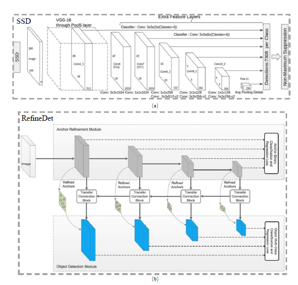
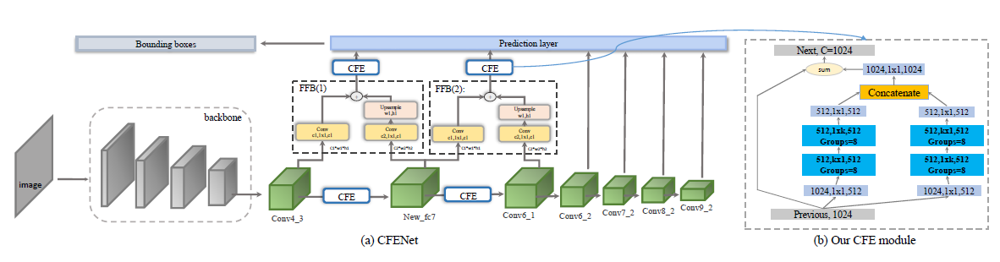

# Object Detection with CFENet

## Repo 结构：

    |
    |----README.md
    |
    |----basemodels：后端基础模型
    |      |----vgg16.py
    |      |----resnet.py 
    |
    |----cfe.py:CFENet主体网络
    |
    |----data.py:生成训练和测试数据集
    |
    |----evaluation.py:检测效果评估网络
    |
    |----ssd.py:SSD网络
    |
    |----test.py:脚本用于模型测试
    |
    |----train.py：模型训练脚本

## SSD and RefineDet Architecture

## CFENet Architecture

## Features
- [x] vgg16后端模型构建
- [ ] resnet后端模型构建
- [ ] ssd模型搭建
- [ ] refinedet模型搭建
- [ ] cfenet模型搭建
- [ ] 训练数据集清洗和生成(DeepDrive)
- [ ] 构建训练和评估pipeline
- [ ] 模型训练，debug与调参
- [ ] ONNX Converter
- [ ] 加入TensorRT模型加速
